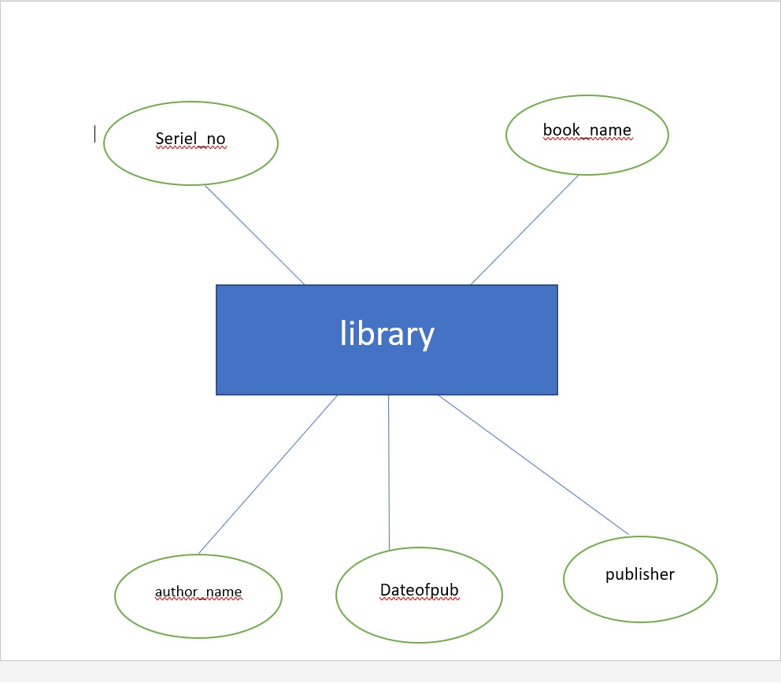

# Ex02 Django ORM Web Application
## Date: 29-2-2024

## AIM
To develop a Django application to store and retrieve data from a Book database using Object Relational Mapping(ORM).

## Entity Relationship Diagram



## DESIGN STEPS

### STEP 1:
Clone the problem from GitHub

### STEP 2:
Create a new app in Django project

### STEP 3:
Enter the code for admin.py and models.py

### STEP 4:
Execute Django admin and create details for 10 books

## PROGRAM

```
models.py

from django.db import models
from django.contrib import admin
class Library(models.Model):
    serial_no=models.IntegerField(primary_key=True);
    book_name=models.CharField(max_length=40);
    author_name=models.CharField(max_length=20);
    publisher=models.CharField(max_length=30);
    dateofpub=models.DateField();
class LibraryAdmin(admin.ModelAdmin):
    list_display=("serial_no","book_name","author_name","publisher","dateofpub");

admin.py

from django.contrib import admin
from.models import Library,LibraryAdmin
admin.site.register(Library,LibraryAdmin)

```

## OUTPUT


## RESULT
Thus the program for creating a database using ORM hass been executed successfully
